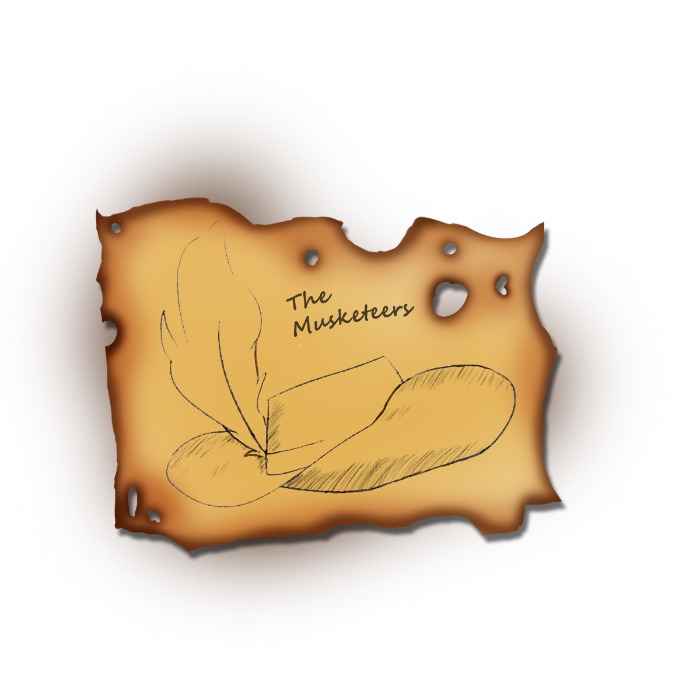

# Hello, we are team the Musketeers!

# Contributors

<table style="width:100%">
  <tr>
    <td>Maksimiliyan Dimov</td>
    <td>10 A</td>
    <td>Scrum Trainer</td>
    <td><MKDimov19@codingburgas.bg></td>
    <td><a href="https://www.linkedin.com/in/maximilian-dimov-5105a722b/">LinkedIn</a><td>
    
  </tr>
   </tr>
  <tr>
    <td>Mario Boshev</td>
    <td>10 V</td>
    <td>Back End Developer</td>
    <td><MVBoshev19@codingburgas.bg></td>
    <td><a href="https://www.linkedin.com/in/mario-boshev-2b1360231/">LinkedIn</a><td>
    
  </tr>
    <tr>
    <td>Teodor Karchev</td>
    <td>10 B</td>
    <td>Front End Developer</td>
    <td><TTKarchev19@codingburgas.bg></td>
    <td><a href="https://www.linkedin.com/in/teodor-karchev-53968222b/">LinkedIn</a><td>
    
  </tr>
   <tr>
    <td>Ivaylo Radev</td>
    <td>10 G</td>
    <td>Designer</td>
    <td><IMRadev19@codingburgas.bg></td>
    <td><a href="https://www.linkedin.com/in/ivaylo-radev-969318231/">LinkedIn</a><td>
</table>

# Features

# Links

* [Presentation]()
* [Documentation]()

